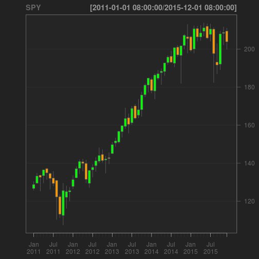

# [Easy Online Stock Analysis and ... Forecast!]

---

## Step 1: Pick any stock



--- 

## Step 2: Divide and conquer

Decompose time series into

1. <h3>Trend</h3>
2. <h3>Seasonal</h3>
3. <h3>Residual</h3>


```r
library(quantmod)
help(decompose)
```

--- 


## Step 3: Look into the future

- <h3>24 months forecast</h3>
- <h3>Predicton intervals</h3>


```r
library(forecast)
help(ets)
help(forecast)
```

---

# Check it out now! [<h3>https://wzhang.shinyapps.io/shinyapp/</h3>](https://wzhang.shinyapps.io/shinyapp/)

